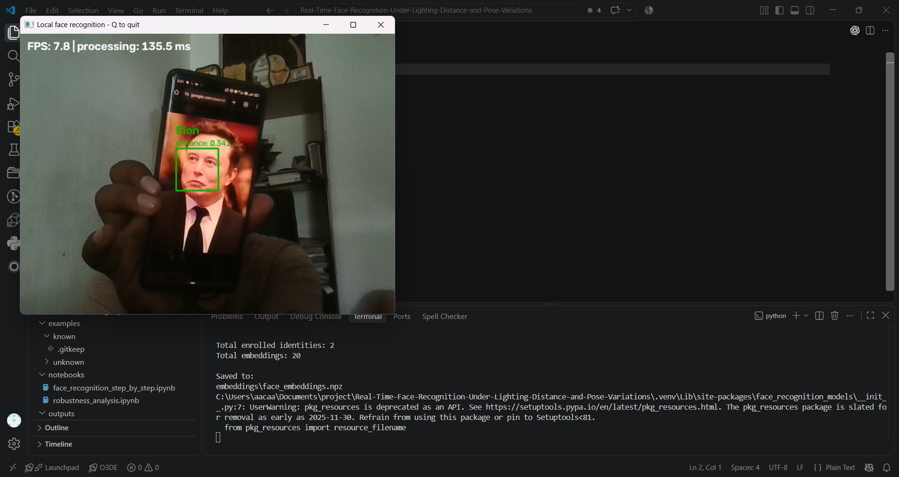
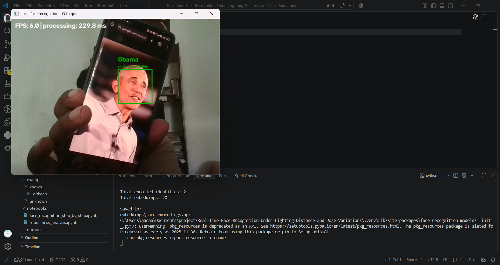
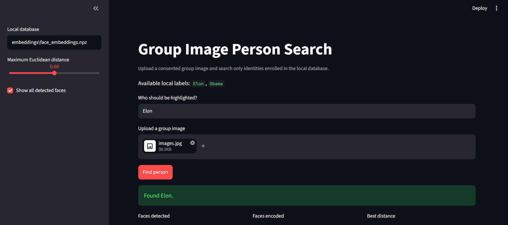
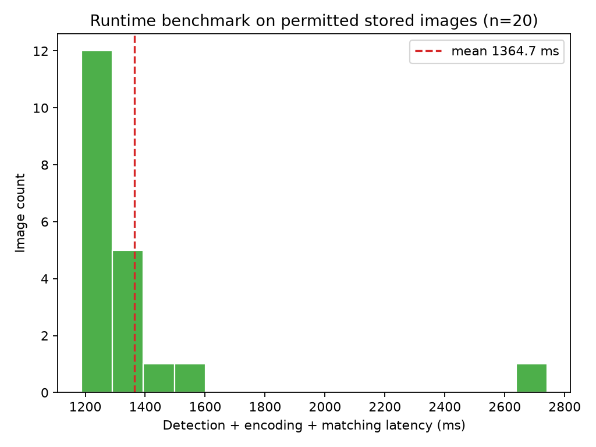

# Local Face Recognition and Group Image Person Retrieval

A consent-based computer-vision project for local enrollment, saved-image and
webcam face recognition, requested-person retrieval in group photographs, spatial
localization, evaluation, and runtime benchmarking. It includes both a command-line
workflow and a Streamlit interface.

> Educational, consent-based use only. The system recognizes explicitly enrolled
> local labels. It performs no internet identity lookup, scraping, public-database
> matching, remote monitoring, or hidden capture.

## Project Overview

The project detects every visible face, represents each encodable face as a
128-dimensional embedding, compares it with locally stored enrollment references,
and uses a Euclidean-distance threshold to accept or reject a match.

It supports two related workflows:

- **Face recognition:** "Who is this detected face?"
- **Person retrieval:** "Where is this requested enrolled identity in the group?"

The Streamlit interface adds a text-first workflow: upload a group image, type a
request such as `Find Person_A and Person_B`, and receive an annotated image with
each valid local match highlighted. The text parser only maps the request to
enrolled labels; it does not identify a person visually or contact an LLM.

It uses a pretrained dlib face representation through `face_recognition`; it does
not train a neural network from scratch. Adding reference images is **enrollment**,
not model training.

## Key Features

- Local webcam enrollment with simple size and blur checks
- HOG face detection and pretrained 128-D face embeddings
- Multiple reference embeddings for each enrolled identity
- Euclidean-distance matching with a configurable `0.60` threshold
- Threshold-based `Unknown` capability
- Saved-image and real-time webcam recognition
- Independent handling of multiple visible faces
- Requested-person retrieval and localization in group images
- Streamlit upload/search interface with annotated-image download
- Single- or multi-name text requests such as `Find Person_A and Person_B`
- Identity, distance, FPS, and latency overlays
- Debug output for face count, closest label, distance, and decision
- Held-out evaluation and confusion-matrix infrastructure
- Threshold and robustness-analysis infrastructure
- Stored-image runtime benchmarking
- Optional group-search timing for detection, encoding, matching, and total latency
- Automated matching/database tests and two learning notebooks

## Current Scope

| Capability | Status |
|---|---|
| Local webcam enrollment | Implemented |
| Saved-image and webcam recognition | Implemented |
| Multiple-face detection and encoding | Implemented |
| Group-image retrieval for one or more requested people | Implemented |
| Streamlit upload and text-search UI | Implemented |
| Threshold-based rejection | Implemented |
| Evaluation and runtime benchmarking | Implemented |
| Internet, celebrity, or public-database identity search | Not supported |
| LLM-based visual identification | Not supported or required |

## System Architecture

```text
Webcam / permitted single image / permitted group image
                         |
                  Detect every face
                         |
             Keep each box aligned with its
                 128-D face embedding
                         |
          Compare with local enrollment references
                         |
              Minimum Euclidean distance
                         |
             Apply maximum-distance threshold
                         |
    Recognize each face OR localize requested targets
```

## Face Detection and Recognition Screenshots

The following screenshots show real-time recognition of two locally enrolled,
consenting participants.

> **Participant-label note:** `Obama` and `Elon` are local labels used for
> consenting project participants. The system does not perform internet identity
> lookup or public-figure identification.

### Elon



### Obama



The examples demonstrate the recognition pipeline using photographs displayed to a
webcam. This is not liveness verification, and the project has no anti-spoofing
capability. Each visible rectangle comes from face detection; the label is added
only after embedding comparison and threshold acceptance.

## How Face Matching Works

For every detected face:

```text
face image → embedding → compare all references → minimum distance → threshold
```

The project retains every valid enrollment embedding rather than averaging them.
This allows a query to match the closest permitted reference view while keeping the
logic easy to inspect.

The actual metric is Euclidean distance:

```python
distance = np.linalg.norm(query_embedding - reference_embedding)
```

Smaller means closer under the embedding model. Distance is not a confidence
percentage or calibrated probability.

The default maximum accepted distance is `0.60`:

```python
if best_distance <= threshold:
    label = best_name
else:
    label = "Unknown"
```

A stricter threshold can reject more enrolled faces; a lenient threshold can accept
more incorrect matches. Unknown rejection is implemented but has not yet been
systematically evaluated with a held-out Unknown dataset.

## Enrollment

Capture one consenting local participant:

```bash
python enroll.py --name Obama --samples 10
python enroll.py --name Elon --samples 10
```

In the camera window, `SPACE` captures and `Q` quits. Enrollment rejects zero-face,
multiple-face, heavily blurred, and unencodable images and warns when a face is very
small.

Build and inspect the local embedding database:

```bash
python face_database.py --build
python face_database.py --list
```

The current private database contains 10 reference embeddings for each of the two
local labels. Raw images and embeddings remain excluded from Git.

## Real-Time Recognition

```bash
python recognize.py --camera 0
```

Press `Q` to quit. Webcam mode processes half-resolution frames by default and
recognizes every second frame for responsiveness. Adjust these settings explicitly:

```bash
python recognize.py --threshold 0.60 --scale 0.5 --process-every 2 --debug
```

Test one permitted saved image at full resolution:

```bash
python recognize.py --image examples/known/test.jpg --debug
```

## Group Image Person Retrieval

Group retrieval answers a different question from ordinary recognition: instead of
asking "Who is each detected face?", it asks "Where is this requested, enrolled
identity in the group?"

```text
Permitted group image
        -> detect every face
        -> generate one embedding per encodable face
        -> select a requested local identity
        -> compare each face with all of that identity's references
        -> choose the minimum Euclidean distance
        -> apply the existing threshold
        -> localize the closest valid face
```

Place a private, consented group photograph under `examples/group/` (the contents
are ignored by Git), then run:

```powershell
python group_search.py --image examples/group/group_01.jpg --person Person_A --show
```

Use `--output path/to/result.png` to choose the saved path and
`--show-all-faces` to add subtle context boxes. The closest valid target is drawn
with a distinct green box and a label such as `Person_A | d=0.438`. The value is
Euclidean distance, not a confidence probability. Without `--output`, results are
saved under `outputs/group_search/` using a non-overwriting filename.

The requested label must already exist in the local embedding database. The tool
does not identify strangers or query any internet or public identity service.

### Simple local UI

The Streamlit UI accepts single-name requests such as `Find Person_A` and
multi-name requests such as `Find Person_A and Person_B` or
`Highlight Person_A, Person_B, and Person_C`. The lightweight parser maps that
text to existing local labels; it does not inspect the image to invent names and
does not require an LLM or paid API.

```powershell
streamlit run group_search_ui.py
```

Open the local address printed by Streamlit, upload a permitted group image, type
the request, and select **Find person**. The annotated result can be downloaded
from the page. Public-figure lookup, celebrity databases, and internet face search
are intentionally unsupported.



The sidebar controls the database, threshold, and optional context boxes. The main
panel accepts the local-label request and group image, then reports detected faces,
encodable faces, found targets, per-target distances, and the annotated result.
Every accepted target receives a distinct box color, and one detected face cannot
be assigned to two requested identities. Detection and recognition examples from
the webcam workflow are shown in the earlier
**Face Detection and Recognition Screenshots** section.

## Runtime Performance

The runtime benchmark was executed on the 20 permitted enrollment images solely to
measure processing speed. These images were **not** used to claim recognition
accuracy or held-out performance.

| Runtime metric | Measured result |
|---|---:|
| Images processed | 20 |
| Faces detected | 20 |
| Mean latency | 1364.73 ms |
| Median latency | 1272.73 ms |
| Minimum latency | 1186.40 ms |
| Maximum latency | 2742.21 ms |
| Approximate throughput | 0.73 images/s |

Values are traceable to
[`outputs/metrics/performance_metrics.csv`](outputs/metrics/performance_metrics.csv).
They measure detection, encoding, and matching on this machine; they are not the
webcam display FPS.



Reproduce the runtime-only benchmark with:

```bash
python benchmark.py --test-dir data/enrolled
```

For group-search timing, create a private manifest next to the group images:

```csv
image,target
group_01.jpg,Person_A
group_02.jpg,Person_B
```

Then measure detection, total encoding, requested-identity matching, and total
latency with actual images:

```bash
python benchmark.py --group-manifest examples/group/manifest.csv
```

This writes `outputs/metrics/group_search_benchmark.csv`. No group-size latency
figure or retrieval-accuracy claim is produced until real, held-out group data is
available.

## Evaluation Methodology

Recognition accuracy must use images that were not used for enrollment. The expected
private structure is:

```text
data/test/
├── Obama/
└── Elon/
```

Run folder-based evaluation with:

```bash
python evaluate.py
```

For future condition labels, use `data/test/manifest.csv`:

```csv
image,expected_identity,condition
Obama/normal_01.jpg,Obama,normal
Elon/left_01.jpg,Elon,left
```

The evaluation code records expected label, prediction, closest label, Euclidean
distance, threshold, latency, face size, detection count, and correctness. When the
sample supports it, the pipeline can generate a confusion matrix, threshold table,
condition plots, latency distribution, and private failure montage.

## Planned Held-Out Evaluation

> A held-out evaluation set has not yet been collected. Enrollment images are
> intentionally not reused as test samples, so recognition accuracy and a confusion
> matrix are not reported yet.

Once separate test images exist, `evaluate.py` can generate:

```text
outputs/metrics/evaluation_results.csv
outputs/metrics/evaluation_summary.json
outputs/metrics/threshold_results.csv
outputs/metrics/robustness_results.csv
outputs/figures/confusion_matrix.png
outputs/figures/threshold_analysis.png
```

No systematic Unknown-person dataset currently exists. Open-set rejection testing,
lighting, distance, and pose experiments remain future work rather than completed
results.

## Project Structure

```text
.
├── README.md
├── LEARNING_GUIDE.md
├── EXPERIMENTS.md
├── requirements.txt
├── enroll.py
├── recognize.py
├── evaluate.py
├── benchmark.py
├── group_search.py
├── group_search_ui.py
├── person_retrieval.py
├── face_detector.py
├── face_encoder.py
├── face_database.py
├── utils.py
├── data/
│   ├── enrolled/                  # private local reference images
│   └── test/                      # private held-out images (currently empty)
├── embeddings/                    # private face_embeddings.npz
├── examples/
│   ├── known/                     # private saved-image demo input
│   ├── unknown/
│   └── group/                     # private consented group images
├── notebooks/
│   ├── face_recognition_step_by_step.ipynb
│   └── robustness_analysis.ipynb
├── outputs/
│   ├── examples/
│   │   ├── group_search_ui.png
│   │   ├── elon_live_detection.png
│   │   └── obama_live_detection.png
│   ├── figures/
│   │   └── latency_results.png
│   ├── group_search/              # private annotated retrieval results
│   └── metrics/
│       ├── performance_metrics.csv
│       └── group_search_benchmark.csv  # generated after real measurements
└── tests/
    ├── test_embeddings.py
    ├── test_matching.py
    └── test_person_retrieval.py
```

## Installation

Python 3.11 is recommended.

```bash
python -m venv .venv
```

Windows PowerShell:

```powershell
.\.venv\Scripts\Activate.ps1
python -m pip install --upgrade pip
python -m pip install -r requirements.txt
python -m pip install face-recognition==1.3.0 --no-deps
```

Windows uses the prebuilt `dlib-bin` package listed in `requirements.txt`. Installing
`face-recognition` with `--no-deps` prevents pip from attempting to rebuild ordinary
dlib. The other direct runtime dependencies are already listed explicitly.

macOS/Linux:

```bash
source .venv/bin/activate
python -m pip install --upgrade pip
python -m pip install -r requirements.txt
```

On non-Windows systems, ordinary dlib may require CMake and a working C++ compiler.

## Learning Notebooks

- `notebooks/face_recognition_step_by_step.ipynb` teaches images, detection,
  embeddings, enrollment, matching, thresholds, webcam inference, evaluation, and
  group-image person retrieval.
- `notebooks/robustness_analysis.ipynb` loads actual output CSVs and clearly
  separates available runtime measurements from planned robustness experiments.

Missing evaluation inputs produce `DATA COLLECTION REQUIRED`; neither notebook
constructs artificial accuracy or robustness values.

## Tests

The automated tests cover synthetic distance behavior, threshold decisions,
Unknown classification logic, shape validation, NPZ database round-tripping, and
group retrieval/localization without requiring face images or a webcam.

```bash
python -m pytest --basetemp=.pytest_tmp -vv
```

Latest verified result: **26 passed**.

## Privacy

- Enrollment images, test images, embeddings, and saved demo inputs are ignored.
- Group inputs and annotated group-search outputs are private and ignored by default.
- Only the two participant-approved live screenshots are public examples.
- Aggregate CSV/JSON metrics and non-biometric figures may be committed.
- `failure_cases.png` stays private because it may contain participant faces.
- Do not force-add ignored biometric files.

## Limitations

- Only two enrolled participants
- No held-out recognition dataset yet
- No systematic Unknown-person evaluation yet
- Small private enrollment set
- Pretrained face representation rather than task-specific model training
- Performance depends on camera, image size, lighting, blur, and pose
- Threshold requires more calibration
- Group retrieval can search only identities already enrolled locally
- Very small, low-quality, heavily occluded, or extreme-pose faces may not encode
- Only visible faces that the detector finds can be retrieved
- No liveness or spoof detection
- Not security-grade authentication and not intended for surveillance

## Future Work

- Collect separate held-out images for both enrolled labels
- Collect a consented Unknown-person evaluation set
- Generate real accuracy and confusion-matrix results
- Calibrate the threshold with known and unknown validation data
- Run controlled normal/dim/bright lighting experiments
- Run controlled near/medium/far distance experiments
- Run frontal/left/right/up/down pose experiments
- Add temporal smoothing and study face alignment
- Compare embedding models in a separate controlled experiment
- Study liveness detection as a separate consent-based extension
- Measure group size versus latency with real group photographs
- Study target face size, occlusion, and pose versus retrieval success
- Measure top-1 retrieval accuracy on held-out group images

